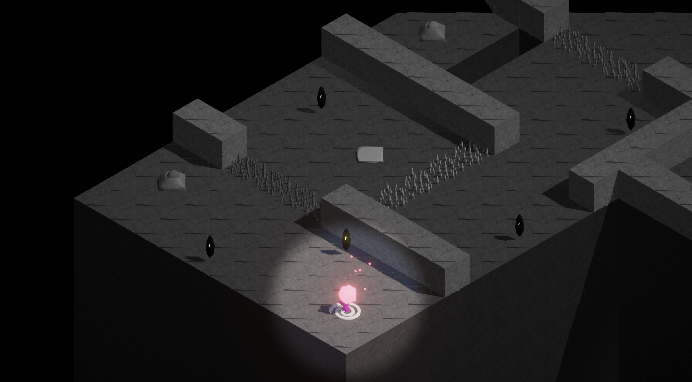

# Star of The Abyss ✨

This is a Unity-based game project developed during the first year of my university studies as part of a group assignment. The project involved collaboration through Git, with multiple contributors working on different features and systems.

> ** Please note: **  This repository is a hard copy of the original group repository. I initially attempted to fork and rebase it properly, but due to some complications with Git history and merge conflicts, I opted to clone it instead for the sake of keeping a clean local working copy. I'm still in the process of improving my Git workflow and version control practices.

--- 

## 🎮 Game Synopsis

Star of the Abyss is an isometric puzzle platformer with inspiration from games such as Voxelbot, Portal and Chip’s Challenge. The thematic lore inspiration comes from a previous board game we've created called Snake Abyss, where you play as a large snake creature sent out by the stars. In the board game you are traversing a barren abyss with the goal to restore the lands to their former glory. In Star of the Abyss the snakes have gotten corrupt, and you have been chosen by the stars for a mission to eliminate the snakes one by one by making your way across their backs to finally reach the weak spot on their heads and finish them off. To make your way across the snakes you have to complete various puzzles, and to help you with the task the stars have given you a mysterious star fragment with special abilities.

---

## 🛠️ How to Run the Project

To run or build this project locally, follow these steps:

1. **Clone the repository**  
   ```bash
   git clone https://github.com/SxDev188/star-of-the-abyss.git
   ```

2. **Open the project in Unity**  
   - This project was developed using **Unity 2022.3.48f1** (or similar versions).  
   - Open Unity Hub, click `Open`, and select the cloned project folder.

3. **Build the game (optional)**  
   - In Unity, go to `File > Build Settings`  
   - Choose your desired platform (e.g., Windows, Mac, WebGL)  
   - Click `Build`, and select a folder to export the build

> ⚠️ If Unity shows errors on load, make sure the correct version is installed and all required packages have been resolved via the Package Manager.

---

## 📸 Screenshots

Here’s a sneak peek of the game in action:



---

## 👨‍👩‍👧‍👦 Contributors

This game was created as a group project. The group consists of:
- SxDev188 (Me)  – Programmer, 3D Artist, Level Design
- Nekonande (Karin) – Programmer, Graphics & Animations, Level Design
- Goobie34 (Gabbriel) – Programmer, Sound Designer, Level Design
- Spriteapple (Emil) - Programmer, Lead Level Designer
- Rixa65 (Linus) – Programmer

---

## 📚 License

This project was developed for educational purposes as part of a university assignment.  
Feel free to explore the code and assets, but please contact each of the contributors before using it in other projects.

---

## 💬 Contact

For questions, feedback, or collaboration ideas, feel free to reach out via [GitHub](https://github.com/SxDev188) or email.
